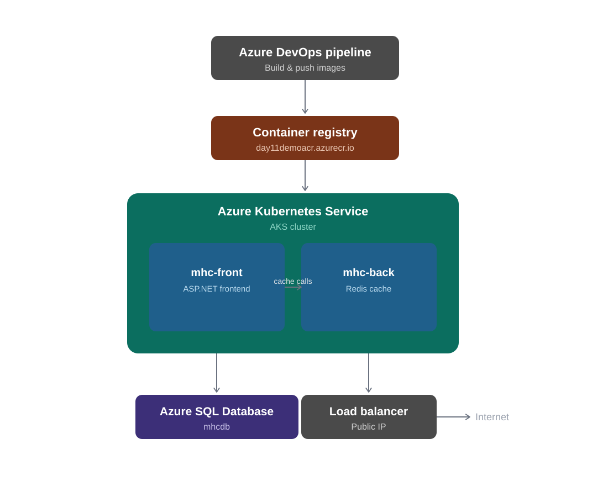

# ☁️ Azure AKS Three-Tier App Deployment — MyHealthClinic

> Production-style three-tier application deployed on Azure Kubernetes Service (AKS), fully automated with Azure DevOps CI/CD — Docker build, Azure Container Registry, AKS release, and Azure SQL Database integration.

**Author:** Muhammad Saad Hussain  
**GitHub:** [@saadhussain07](https://github.com/saadhussain07)  
**LinkedIn:** [muhammad-saad-hussain](https://www.linkedin.com/in/muhammad-saad-hussain-28435b3a2/)  
**Research:** IEEE TNSM — Multi-Agent LLM AIOps Framework  
**Application source:** [piyushsachdeva/MyHealthClinic-AKS](https://github.com/piyushsachdeva/MyHealthClinic-AKS) — this repo covers my infrastructure, pipeline, and deployment work on top of it.
---

## 🏗️ Architecture



**Flow:** Azure Repos → Azure Pipelines (build) → Azure Container Registry → AKS Deployment → Azure Release Pipeline → Public LoadBalancer

---

## ☁️ Infrastructure Provisioned

| Resource | Name | Purpose |
|----------|------|---------|
| Resource Group | `day11-demo-rg` | Container for all Azure resources |
| AKS Cluster | `day11-demo-cluster` | Hosts application pods & LoadBalancer |
| Container Registry | `day11demoacr.azurecr.io` | Stores Docker images, pulled by AKS |
| SQL Server | `saadhussainsql1829` | Hosts the application database |
| SQL Database | `mhcdb` | Persistent data store |
| LoadBalancer | Public IP (e.g. `104.42.63.193`) | Exposes frontend to the internet |

---

## 📦 Application

**MyHealthClinic** (Microsoft sample three-tier app, source credited above)

| Service | Tech | Role |
|---------|------|------|
| `mhc-front` | ASP.NET Core | UI layer — connects to Redis & Azure SQL |
| `mhc-back` | Redis | Caching layer |

### Kubernetes Objects
- **Deployments:** `mhc-front`, `mhc-back` — manage pods, restarts, rolling updates
- **Services:** `mhc-front` (`LoadBalancer`, public IP) · `mhc-back` (`ClusterIP`, internal only)

---

## 🚀 Azure DevOps Pipeline — Stages

| Stage | Action |
|-------|--------|
| 1. Replace Tokens | Injects pipeline variables into `appsettings.json` & `mhc-aks.yaml` |
| 2. Docker Compose | Runs `docker-compose.ci.build.yml` to start build services |
| 3. Build Images | Builds app images, tagged with `$(Build.BuildId)` (e.g. `myhealth.web:35`) |
| 4. Push Images | Pushes to `day11demoacr.azurecr.io` |
| 5. Publish Artifacts | Publishes K8s manifests, DACPAC, and Compose lock file |

**Release Pipeline** rolls out the new image using:
```bash
kubectl set image deployments/mhc-front mhc-front=$(ACR)/myhealth.web:$(Build.BuildId)
```

### `azure-pipelines.yml`

```yaml
trigger:
  branches:
    include:
      - main

pool:
  vmImage: 'ubuntu-latest'

variables:
  acrName: 'day11demoacr'
  imageName: 'myhealth.web'
  buildId: '$(Build.BuildId)'

stages:
  - stage: Build
    displayName: 'Build and push image'
    jobs:
      - job: BuildAndPush
        steps:
          - task: replacetokens@5
            displayName: 'Replace tokens'
            inputs:
              targetFiles: |
                **/appsettings.json
                **/mhc-aks.yaml
              tokenPrefix: '#{'
              tokenSuffix: '}#'

          - task: DockerCompose@0
            displayName: 'Build services with Docker Compose'
            inputs:
              action: 'Run a Docker Compose command'
              dockerComposeFile: 'docker-compose.ci.build.yml'
              dockerComposeCommand: 'build'

          - task: Docker@2
            displayName: 'Build image'
            inputs:
              command: 'build'
              repository: '$(imageName)'
              dockerfile: '**/Dockerfile'
              tags: '$(buildId)'

          - task: Docker@2
            displayName: 'Push image to ACR'
            inputs:
              command: 'push'
              containerRegistry: 'acr-service-connection'
              repository: '$(imageName)'
              tags: '$(buildId)'

          - task: PublishBuildArtifacts@1
            displayName: 'Publish deployment artifacts'
            inputs:
              PathtoPublish: 'manifests'
              ArtifactName: '_3-Tier-app on AKS'
              publishLocation: 'Container'

  - stage: Release
    displayName: 'Deploy to AKS'
    dependsOn: Build
    jobs:
      - deployment: DeployToAKS
        environment: 'dev'
        strategy:
          runOnce:
            deploy:
              steps:
                - task: KubernetesManifest@1
                  displayName: 'Set image on deployment'
                  inputs:
                    action: 'deploy'
                    kubernetesServiceConnection: 'aks-service-connection'
                    namespace: 'default'
                    manifests: 'manifests/mhc-aks.yaml'
                    containers: '$(acrName).azurecr.io/$(imageName):$(buildId)'
```

> Reconstructed to match the pipeline flow used in this project (Replace Tokens → Docker Compose → Build → Push → Publish → Release). Swap in your actual task GUIDs/service connection names if committing this directly.

---

## 🧱 Infrastructure Provisioning Script

`infra.sh` — creates Resource Group → AKS → ACR → ACR attach → SQL Server → SQL Database:

```bash
#!/bin/bash
REGION="westus"
RGP="day11-demo-rg"
CLUSTER_NAME="day11-demo-cluster"
ACR_NAME="day11demoacr"
SQLSERVER="saadhussainsql1829"
DB="mhcdb"

# Create Resource group
az group create --name $RGP --location $REGION

# Deploy AKS
az aks create --resource-group $RGP --name $CLUSTER_NAME --enable-addons monitoring --generate-ssh-keys --location $REGION

# Deploy ACR
az acr create --resource-group $RGP --name $ACR_NAME --sku Standard --location $REGION

# Authenticate ACR with AKS
az aks update -n $CLUSTER_NAME -g $RGP --attach-acr $ACR_NAME

# Create SQL Server and DB
az sql server create -l $REGION -g $RGP -n $SQLSERVER -u sqladmin -p P2ssw0rd1234

az sql db create -g $RGP -s $SQLSERVER -n $DB --service-objective S0

# Allow Azure services through the SQL firewall
az sql server firewall-rule create \
  --resource-group $RGP \
  --server $SQLSERVER \
  --name AllowAzureServices \
  --start-ip-address 0.0.0.0 \
  --end-ip-address 0.0.0.0
```

```bash
chmod +x infra.sh
./infra.sh
```

---

## 🧹 Infrastructure Teardown Script

`destroy-infra.sh` — removes all provisioned resources in reverse order:

```bash
#!/bin/bash

REGION="westus"
RGP="day11-demo-rg"
CLUSTER_NAME="day11-demo-cluster"
ACR_NAME="day11demoacr"
SQLSERVER="saadhussainsql1829"
DB="mhcdb"

handle_error() {
    echo "Error: $1"
    exit 1
}

resource_exists() {
    az resource show --ids $1 &> /dev/null
}

# Delete AKS
if resource_exists $(az aks show --resource-group $RGP --name $CLUSTER_NAME --query id --output tsv); then
    az aks delete --resource-group $RGP --name $CLUSTER_NAME || handle_error "Failed to delete AKS."
else
    echo "AKS not found. Skipping deletion."
fi

# Delete ACR
if resource_exists $(az acr show --name $ACR_NAME --resource-group $RGP --query id --output tsv); then
    az acr delete --name $ACR_NAME --resource-group $RGP || handle_error "Failed to delete ACR."
else
    echo "ACR not found. Skipping deletion."
fi

# Delete SQL Database
if resource_exists $(az sql db show --resource-group $RGP --server $SQLSERVER --name $DB --query id --output tsv); then
    az sql db delete --resource-group $RGP --server $SQLSERVER --name $DB || handle_error "Failed to delete SQL Database."
else
    echo "SQL Database not found. Skipping deletion."
fi

# Delete SQL Server
if resource_exists $(az sql server show --resource-group $RGP --name $SQLSERVER --query id --output tsv); then
    az sql server delete --resource-group $RGP --name $SQLSERVER || handle_error "Failed to delete SQL Server."
else
    echo "SQL Server not found. Skipping deletion."
fi

# Delete Resource Group
if resource_exists $(az group show --name $RGP --query id --output tsv); then
    az group delete --name $RGP || handle_error "Failed to delete Resource Group."
else
    echo "Resource Group not found. Skipping deletion."
fi

echo "Resources successfully deleted."
```

```bash
chmod +x destroy-infra.sh
./destroy-infra.sh
```

---

## 🖼️ Screenshots

```
screenshots/
├── release-pipeline-running.png     # Release-1 — dev deployment in progress
├── release-pipeline-succeeded.png   # Release-3 — dev deployment succeeded
├── app-live.png                     # HealthClinic.biz frontend, live via LoadBalancer
└── pipeline-publish-artifact.png    # Build pipeline — Publish Artifact logs
```

---

## ✅ Validation

```bash
kubectl get pods      # mhc-front, mhc-back → Running
kubectl get svc        # mhc-front → LoadBalancer with public IP
kubectl get nodes      # AKS node → Ready
az aks check-acr       # Confirms cluster can pull from ACR
```

Application accessible at `http://<LoadBalancer-IP>`.

---

## 🛠️ Tech Stack

| Layer | Technology |
|-------|------------|
| Cloud | Microsoft Azure |
| Containers | Docker, Docker Compose |
| Orchestration | Kubernetes (AKS) |
| Registry | Azure Container Registry |
| Database | Azure SQL Server / Azure SQL Database |
| CI/CD | Azure DevOps Pipelines & Release Pipelines |
| Infra Automation | Azure CLI, Bash |
| Application | ASP.NET Core, Redis |

---

## 🎯 Skills Demonstrated

Azure Infrastructure Provisioning · AKS Cluster Management · Azure Container Registry Integration · Azure SQL Administration · Kubernetes Deployments & Services · Docker Image Management · Azure DevOps CI/CD · YAML Pipeline Authoring · Azure Networking · End-to-End Cloud-Native Application Deployment

---

## 🔗 Related Projects

- [🤖 AIOps K8s Framework](https://github.com/saadhussain07) — IEEE TNSM research on autonomous fault detection
- [📊 K8s Monitoring Stack](https://github.com/saadhussain07/k8s-monitoring-stack)
- [🚀 Nike Landing Page — Azure DevOps](https://github.com/saadhussain07/nike-landing-page-azure-devops)
- [⚙️ Flask GitOps ArgoCD](https://github.com/saadhussain07/flask-gitops-argocd-kubernetes-Project)

---

## 📄 License
MIT License

---
<p align="center">⭐ Star this repo if it helped you!</p>